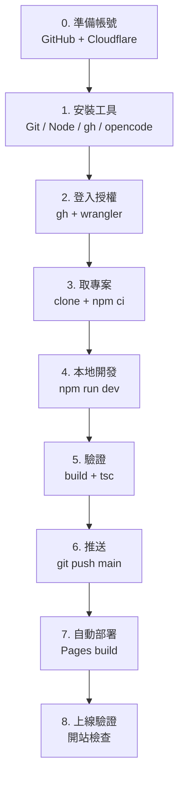
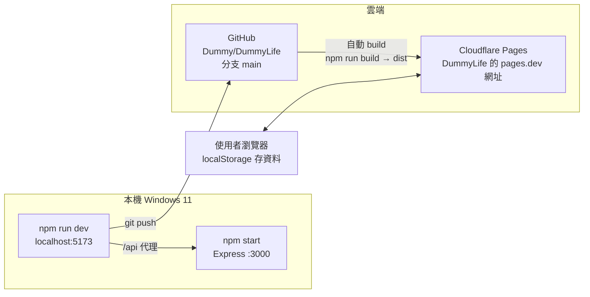
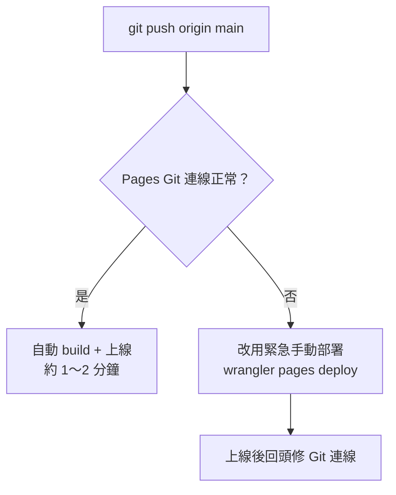
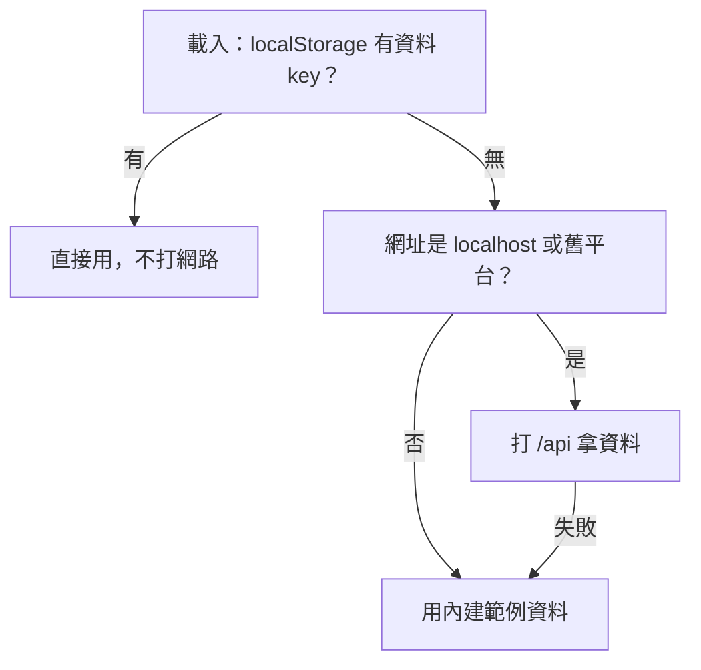

# DummyLife 新機 SOP（Windows 11 + opencode）

> 目標：在一台全新的 Windows 11 上，從零到可以開發、驗證、部署 DummyLife。
> 架構：Vite + React 純靜態（資料存瀏覽器 localStorage）→ GitHub（`main`）→ Cloudflare Pages 自動部署。
> 已知正常版本：Node v24.8.0 / npm 11.6.0 / Git 2.53 / gh 2.92 / wrangler 4.131。
> 註：本檔所有 `Dummy` 均為佔位符，請換成你自己的帳號、信箱與專案名稱。

## 總覽圖（Mermaid，GitHub 會直接渲染成圖）





## 0. 前置帳號（都要先有）

| 帳號 | 用途 | 一定要手動 |
|---|---|---|
| GitHub（`Dummy`） | 放程式碼，Pages 的部署來源 | 是：註冊、開 repo、授權 Cloudflare 存取 repo |
| Cloudflare（跟 `Dummy` 同一帳號） | Pages 託管 | 是：註冊、第一次把 Pages 專案連上 GitHub repo |

## 1. 安裝（新電腦依序裝）

1. **Git for Windows**：https://git-scm.com/download/win ，一路下一步（含 Git Bash）。
2. **Node.js LTS（建議 22 版以上）**：https://nodejs.org ，裝完重開終端機，驗證：
   ```powershell
   node --version; npm --version; git --version
   ```
3. **GitHub CLI（gh）**：https://cli.github.com/ （`winget install GitHub.cli` 也可），驗證 `gh --version`。
4. **opencode**：照官方安裝方式裝完後，驗證 `opencode --version`。
5. 選配：VS Code、Windows Terminal。
6. wrangler 不用事先裝，用 `npx -y wrangler` 即可（本 SOP 都用 npx，版本固定、可重現）。

## 2. 登入與身份（每台新電腦做一次）

```powershell
# GitHub 登入（會開瀏覽器授權，一定要手動按）
gh auth login
gh auth status   # 應看到你的帳號，且有 repo 權限

# Git 身份（換成你自己的名字與信箱）
git config --global user.name "Dummy"
git config --global user.email "Dummy"

# Cloudflare 登入（會開瀏覽器 OAuth，一定要手動按允許）
npx -y wrangler login
npx -y wrangler whoami   # 應看到帳號 + Account ID，且有 pages (write)
```

## 3. 取專案、裝依賴

```powershell
git clone https://github.com/Dummy/DummyLife.git
cd DummyLife
npm ci        # 沒 package-lock 才用 npm install
```

## 4. 本地開發

```powershell
npm run dev      # 前端 http://localhost:5173
# 另開一個終端機（要測 /api 同步才需要）：
npm start        # Express http://localhost:3000，vite 會把 /api 轉過去
```

重點：

- 資料優先讀 `localStorage`（key：`lifeflow-data-v1`），沒有才用 `/api`，都沒有就用內建範例。
- 線上（pages.dev）完全不打 `/api`，只用 localStorage；所以線上 console 不該再出現 `/api/data 405`。
- `server/` 只為本機開發保留；`data/db.json` 是本機舊資料，不進版控。
- 舊平台專用的打包設定檔（如 Zeabur 的 zbpack.json）**不要**推上 GitHub（原理是沒被 `git add`，保持 untracked）。

## 5. 改完後的標準驗證（每次 push 前都跑）

```powershell
npm run build            # 必須成功，產出 dist/
npx -y tsc --noEmit      # 必須無錯誤
git status --short --branch   # 應只有你預期的修改，且在 main、與 origin/main 同步
```

## 6. 部署（正常流程：全自動）

```powershell
git add <你的檔案>
git commit -m "說明"
git push origin main
```

- Cloudflare Pages 專案已接上 GitHub repo，push 到 `main` 約 1～2 分鐘自動重部署。
- 生產網址：你專案的 pages.dev 網址（Dashboard 可查）。
- Dashboard 看進度：Pages > 你的專案 > Deployments。
- 查部署狀態（CLI）：
  ```powershell
  npx -y wrangler pages deployment list --project-name DummyLife
  ```

### 首次才需要：Dashboard 接 Git（一定要手動，一次就好）

Pages > 你的專案 > Settings > Builds & deployments > Connect Git >
選你的 repo，設定：

- Production branch：`main`
- Build command：`npm run build`
- Output directory：`dist`
- Root directory：（留空）

### 緊急手動部署（Git 自動部署壞掉才用）

```powershell
npm run build
npx -y wrangler pages project create DummyLife --production-branch main  # 專案不存在才要
npx -y wrangler pages deploy dist --project-name DummyLife --commit-dirty=true
```

部署路徑圖：



資料讀取邏輯圖（對應 `src/App.tsx`）：



## 7. 上線驗證清單

1. 開你的 pages.dev 網址，標題應為看板名稱。
2. 側邊欄看板、卡片、搜尋、今日焦點都可正常顯示與點擊。
3. 開 DevTools Console：**不應有** `/api/data 405`（有＝代表靜態判斷被改壞）。
4. 隨便新增一張卡片 → 重整還在（localStorage 寫入正常）。
5. `gh repo view --json url,defaultBranchRef` 預設分支應為 `main`。

## 8. 一定要手動、機器做不到的事

1. 新電腦的 `gh auth login`、`wrangler login` 瀏覽器授權點擊。
2. Cloudflare 帳號註冊／登入、第一次 Pages「Connect Git」授權 GitHub。
3. 自訂網域與 DNS（若以後要掛自己的 domain）。
4. 舊平台資料搬遷：把舊主機 `data/db.json` 內容，貼到新站瀏覽器 `localStorage` 的資料 key（或重建卡片）。
5. 多人共用同一份資料：現在是每人瀏覽器各存一份，要共用需另做後端（KV/D1），不在本次範圍。

## 9. 疑難排解

| 症狀 | 原因／解法 |
|---|---|
| `npm run build` 失敗 | 先看第一個報錯；多半是改壞 tsx。跑 `npx tsc --noEmit` 定位 |
| 線上 console 出現 `/api/data 405` | `App.tsx` 的靜態站判斷被改掉；Pages 上只能用 localStorage |
| 開站空白 | 看 `dist/index.html`、`dist/assets` 是否產出；`public/_redirects` 必須存在且內容為 `/* /index.html 200` |
| `git status` 出現 `vite.config.ts.timestamp-*.mjs` | Vite 暫存檔，已在 `.gitignore`，直接刪檔即可 |
| `git push` 被拒 | 先 `git fetch origin`＋`git status`，確認沒落後；分支必須是 `main` |
| PowerShell 說 `head` 不是指令 | Win 內建 PS 5.1 沒有 `head`，改用 `\| Select-Object -First N` |
| `warning: LF will be replaced by CRLF` | Windows 正常現象，忽略 |
| wrangler 顯示專案不存在 | 先跑 `pages project create`（見 §6 緊急流程） |
| push 了但線上沒變 | 到 Dashboard 看 Deployments 是否失敗；檢查 Build command／Output（`npm run build`／`dist`） |

## 10. 視覺化預覽工具（看本檔的圖）

本檔的圖用 Mermaid 寫，GitHub 開檔即自動渲染，不用裝任何東西。

| 工具 | 用法 |
|---|---|
| GitHub 網頁 | push 後直接開本檔，流程圖自動成圖 |
| VS Code | 開檔按 `Ctrl+Shift+V` 預覽；Mermaid 需加裝「Markdown Preview Mermaid Support」擴充 |
| mermaid.live | 貼上 ```mermaid 區段即時預覽、除錯語法 |
| opencode | 直接問「這段 mermaid 有沒有錯」即可幫你檢查 |
